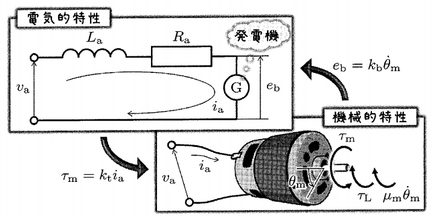

## DCモータの速度制御

---

### やること
- MATLABから現実世界を動かす
  - とりあえず繋いでみる，回してみる
  - 制御がないと何がダメ？
- フィードバック制御について
- 運動方程式を立てる（伝達関数を求める）
- コントローラをつくる（P制御，PI制御）

---

### MATLABから現実世界を動かす
とりあえず繋いでみる

↓制御対象

---

### 制御がないと何がダメ？
電圧 vs 回転数がわかれば目標回転数を出せるはず

$$\dot{\theta}(t)=\omega(t)=\frac{1}{k_E} v(t);~~k_E は逆起電力定数$$

実際には上手く行かない {.fragment .fade}
- 外乱に対して無力 {.fragment .fade}
- 整定までの時間がシステムに依存する {.fragment .fade}

**フィードバック制御**を行うことで解決できる {.fragment .fade}

---

### フィードバック制御
プラント$G(s)$の応答を使って入力$u$を決める方法

1. 伝達関数$G(s)$をつくる
1. $G(s)$のパラメータを求める（プラント同定）
1. コントローラ$C(s)$を決める
1. （コントローラの再調整）

---

### 電気モータのモデル化

川田 昌克, 物理法則に基づくモデリング(基礎編,<特集>初学者のための図解でわかる制御工学I), システム／制御／情報, 2012, 56 巻, 4 号, p. 166-169, 公開日 2017/04/15, Online ISSN 2424-1806, Print ISSN 0916-1600, https://doi.org/10.11509/isciesci.56.4_166, <a href="https://www.jstage.jst.go.jp/article/isciesci/56/4/56_KJ00008019365/_article/-char/ja">https://www.jstage.jst.go.jp/article/isciesci/56/4/56_KJ00008019365/_article/-char/ja</a>

---

### 電気的特性と機械的特性
$$
\left\\{ \begin{array}{rcl}
v_a &=& R_a i_a + L_a \frac{di_a}{dt} + e_b \\\\
e_b &=& k_b \dot{\theta}_m \\\\
J_m \ddot{\theta}_m &=& \tau_m - \tau_L - \mu_m \dot{\theta}_m \\\\
\tau_m &=& k_t i_a
\end{array} \right.
$$

$$v_a: 端子電圧,~~i_a: 電流,~~R_a: 電機子抵抗,~~L_a: 電機子インダクタンス,~~e_b: 逆起電力$$
$$k_b: 逆起電力定数,~~\theta_m: モータ角度,~~J_m: モータの慣性モーメント,~~\tau_m: 発生トルク$$
$$\mu_m: モータの粘性摩擦係数,~~k_t: トルク定数,~~\tau_L: 負荷トルク$$

---

### モータの運動方程式
$L_a \frac{di_a}{dt} \approx 0$として近似（電気的反応は機械的反応に比べて十分速い）

$$
J_m \ddot{\theta}_m + \bar{\mu}_m \dot{\theta}_m + \tau_L = \frac{k_t}{R_a} v_a
$$

<h4>ギヤードモータの場合</h4>
$$
\bar{J}_g \ddot{\theta}_g + \bar{\mu}_g \dot{\theta}_g + \tau _{gL} = \frac{\bar{k_t}}{R_a} v_a
$$
ギヤードモータでも運動方程式の形は同じ．

---

### 伝達関数
#### 電圧→角度（2次遅れ系）
$$
\frac{\Theta}{V_a} = \frac{\bar{k_t}}{R_a \bar{J}_g s^2 + R_a \bar{\mu}_g s}
$$

#### 電圧→角速度（1次遅れ系）
$$
\frac{\Omega}{V_a} = \frac{\bar{k_t}}{R_a \bar{J}_g s + R_a \bar{\mu}_g} = \frac{K}{Ts + 1}
$$

---

### １次遅れ伝達関数の時間応答
 

$K: 定常ゲイン$ 
$T: 時定数$ 
$L: むだ時間$

- 1次遅れ系ではステップ応答の$t=0$での接線と$K$が交わる時間が時定数$T$となる．
- $t=T$のとき，$y(T)=0.632K$

実際にプラント同定をしてみる（$K$と$T$を求める）

---

<h3 style="text-transform:none;">MATLAB/Simulinkで確認</h3>

---

### PI(D)制御系
$$C _{Parallel}(s) = \left(K_P + \frac{1}{s} K_I + K_D s \right) E(s)$$
$$C _{Ideal}(s) = K_P \left(1 + \frac{1}{T_I s} + T_D s \right) E(s)$$

---

### パラメータの決め方
- （Ziegler-Nicholsの）限界感度法
- （Ziegler-Nicholsの）過渡応答法
- CHR法

#### CHR法のパラメータ
|| $K_P$ | $T_I$ | $T_D$ |
| :---: | :---: | :---: | :---: |
| P | $0.3/RL$ | $-$ | $-$ |
| PI | $0.35/RL$ | $1.2T$ | $-$ |
| PID | $0.6/RL$ | $T$ | $0.5L$ |

---

### シミュレーションで確認

$\Downarrow$

### 実機で確認

---

## 参考資料

---

### ロータリーエンコーダの動作
