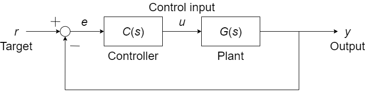

<head></head>

# DCモータの速度制御

---

## やること

- MATLABから現実世界を動かす
  - とりあえず繋いでみる，回してみる
  - 制御がないと何がダメ？
- フィードバック制御について
- 運動方程式を立てる（伝達関数を求める）
- コントローラをつくる（PID制御）

---

## MATLABから現実世界を動かす

- とりあえず繋いでみる
- 回して触ってみる

---

## 制御がないと何がダメ？
電圧 vs 回転数がわかれば目標回転数を出せるはず

$$\dot{\theta}(t)=\omega(t)=\frac{1}{k_E} v(t);~~k_E は逆起電力定数$$

実際には上手く行かない {.fragment .fade}
- 外乱に対して無力 {.fragment .fade}
- 整定までの時間がシステムに依存する {.fragment .fade}

**フィードバック制御**を行うことで解決できる {.fragment .fade}

---

## フィードバック制御
プラント$G$の応答$y$を使って入力$u$を決める方法

一巡伝達関数$G_{Closed}=1$となることが究極の目的
1. 伝達関数$G(s)$をつくる（モデリング）
1. $G(s)$のパラメータを求める（プラント同定）
1. コントローラ$C(s)$を決める
1. （コントローラの再調整）

---

## 電気モータのモデリング

川田 昌克, 物理法則に基づくモデリング(基礎編,<特集>初学者のための図解でわかる制御工学I), システム／制御／情報, 2012, 56 巻, 4 号, p. 166-169, 公開日 2017/04/15, Online ISSN 2424-1806, Print ISSN 0916-1600, https://doi.org/10.11509/isciesci.56.4_166, <a href="https://www.jstage.jst.go.jp/article/isciesci/56/4/56_KJ00008019365/_article/-char/ja">https://www.jstage.jst.go.jp/article/isciesci/56/4/56_KJ00008019365/_article/-char/ja</a>

---

## 電気的特性と機械的特性
$$
\left\\{ \begin{array}{rcl}
v_a &=& R_a i_a + L_a \frac{di_a}{dt} + e_b \\\\
e_b &=& k_b \dot{\theta}_m \\\\
J_m \ddot{\theta}_m &=& \tau_m - \tau_L - \mu_m \dot{\theta}_m \\\\
\tau_m &=& k_t i_a
\end{array} \right.
$$

$v_a:$ 端子電圧，$i_a:$ 電流，$R_a:$ 電機子抵抗，$L_a:$ 電機子インダクタンス，$e_b:$ 逆起電力

$k_b:$ 逆起電力定数，$\theta_m:$ モータ角度，$J_m:$ モータの慣性モーメント，$\tau_m:$ 発生トルク

$\mu_m:$ モータの粘性摩擦係数，$k_t:$ トルク定数，$\tau_L:$ 負荷トルク

---

## モータの運動方程式
$L_a \frac{di_a}{dt} \approx 0$として近似（電気的反応は機械的反応に比べて十分速い）

$$
J_m \ddot{\theta}_m + \bar{\mu}_m \dot{\theta}_m + \tau_L = \frac{k_t}{R_a} v_a
$$

### ギヤードモータの場合
$$
\bar{J}_g \ddot{\theta}_g + \bar{\mu}_g \dot{\theta}_g + \tau _{gL} = \frac{\bar{k_t}}{R_a} v_a
$$
ギヤードモータでも運動方程式の形は同じ．

---

## 伝達関数と標準形
### 電圧→角度（2次遅れ系）
$$
\frac{\Theta}{V_a} = \frac{\bar{k_t}}{R_a \bar{J}_g s^2 + R_a \bar{\mu}_g s} = \frac{K {\omega_n}^2}{s^2 + 2 \zeta \omega_n s + {\omega_n}^2}
$$

### 電圧→角速度（1次遅れ系）
$$
\frac{\Omega}{V_a} = \frac{\bar{k_t}}{R_a \bar{J}_g s + R_a \bar{\mu}_g} = \frac{K}{Ts + 1}
$$

---

## 1次遅れ伝達関数のプラント同定
 

$K: 定常ゲイン$ 
$T: 時定数$ 
$L: むだ時間$

- 1次遅れ系ではステップ応答の$t=L$での接線と定常応答$y(\infty)=K$が交わる時間が時定数$T$
- $y(L+t)=K(1-e^{-1/T})$より$y(L+T)=0.63K$

$\Downarrow$

**プラント同定をしてみる**（$K,T,L$を求める）

---

## MATLAB/Simulinkで確認

---

## PID制御系
- 並列形
$$C _{Parallel}(s) = \left(K_P + \frac{1}{s} K_I + K_D s \right)$$

- イデアル形
$$C _{Ideal}(s) = K_P \left(1 + \frac{1}{T_I s} + T_D s \right)$$

---

## パラメータの決め方
- （Ziegler-Nicholsの）限界感度法
- （Ziegler-Nicholsの）過渡応答法
- CHR法

### CHR法のパラメータ（目標値制御，OS 0%）
|| $K_P$ | $T_I$ | $T_D$ |
| :---: | :---: | :---: | :---: |
| P | $0.3/RL$ | $-$ | $-$ |
| PI | $0.35/RL$ | $1.2T$ | $-$ |
| PID | $0.6/RL$ | $T$ | $0.5L$ |

<a href="https://ja.wikipedia.org/wiki/PID%E5%88%B6%E5%BE%A1">Wikipedia PID制御</a>

---

## シミュレーションで確認

$\Downarrow$

## 実機で確認

---

## 参考資料

---

## ロータリーエンコーダの動作

 

- 一定の角度ごとに生成されるパルスの数をカウントすることで角度を計測できる
- 回転方向はA相とB相の位相により判別する

---

## Pre/Postは何をしているのか

- Pre
  - 単位変換（入力バイアスの除去）
  - 物理値からD/A電圧への変換
  - 物理値からPWMへの変換
- Post
  - A/D電圧から物理値への変換
  - パルスから物理値への変換（Pulse→rad）
  - 単位変換
- 両方
  - 状態に依存しない非線形要素の補償