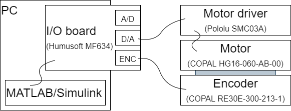

<head></head>

# DCモータのトルク制御

---

## やること

- MATLABから現実世界を動かす
  - とりあえず繋いでみる，回してみる
  - 制御がないと何がダメ？
- フィードバック制御について
- 運動方程式を立てる（伝達関数を求める）
- コントローラをつくる（PID制御）

---

## 今回の構成

- 速度制御との違いを確認する

---

## 電気モータのモデリング（再掲）

川田 昌克, 物理法則に基づくモデリング(基礎編,<特集>初学者のための図解でわかる制御工学I), システム／制御／情報, 2012, 56 巻, 4 号, p. 166-169, 公開日 2017/04/15, Online ISSN 2424-1806, Print ISSN 0916-1600, https://doi.org/10.11509/isciesci.56.4_166, <a href="https://www.jstage.jst.go.jp/article/isciesci/56/4/56_KJ00008019365/_article/-char/ja">https://www.jstage.jst.go.jp/article/isciesci/56/4/56_KJ00008019365/_article/-char/ja</a>

---

## 電気的特性と機械的特性（再掲）
$$
\left\\{ \begin{array}{rcl}
v_a &=& R_a i_a + L_a \frac{di_a}{dt} + e_b \\\\
e_b &=& k_b \dot{\theta}_m \\\\
J_m \ddot{\theta}_m &=& \tau_m - \tau_L - \mu_m \dot{\theta}_m \\\\
\tau_m &=& k_t i_a
\end{array} \right.
$$

$v_a:$ 端子電圧，$i_a:$ 電流，$R_a:$ 電機子抵抗，$L_a:$ 電機子インダクタンス，$e_b:$ 逆起電力

$k_b:$ 逆起電力定数，$\theta_m:$ モータ角度，$J_m:$ モータの慣性モーメント，$\tau_m:$ 発生トルク

$\mu_m:$ モータの粘性摩擦係数，$k_t:$ トルク定数，$\tau_L:$ 負荷トルク

---

## 伝達関数（1次遅れ系，0型）
電気的反応の固有値$\ll$機械的反応の固有値を仮定 
（電気的反応は機械的反応に比べて十分速い）

$$
I_a = \frac{1}{L_a s + R_a} V_a - \frac{1}{L_a s + R_a} D
$$

- トルクは$\tau_m=k_t i_a$によって得られるものとし，$i_a$についてフィードバックする 
（減速比$n$のギヤドモータの場合，末端のトルクは$\tau_g=n\tau_m=n k_t i_a$）
- $D(=e_b)$は未知外乱とする

---

## 1次遅れ伝達関数のプラント同定
T.B.D.

MATLAB/Simulinkではサンプリング周期を1ms以下に設定できない？